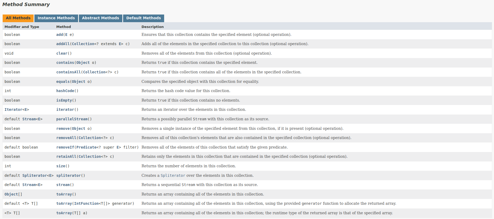

#  Collection Framework API

* Uma coleção (collection) é uma estrutura de dados que serve para agrupar muitos elementos em uma única unidade, estes elementos precisão ser Objetos.
* Uma Collection pode ter coleções homogêneas e heterogêneas, normalmente utilizamos coleções homogêneas de um tipo especifico.
* O núcleo principal das coleções é formado pelas interfaces da figura a abaixo, essas interfaces permitem manipular a coleção independente do nível de detalhe que elas representam.
* Temos quatro grandes tipos de coleções: `List` (lista), `Set` (conjunto), `Queue` (fila) e `Map` (mapa), a partir dessas interfaces, temos muitas subclasses concretas que implementam varias formas diferentes de se trabalhar com cada coleção.

 
[Hierarchy of Collection Framework in Java](https://data-flair.training/blogs/collection-framework-in-java/)

* Todas as interfaces e classes são encontradas dentro do pacote (package) `java.util`.
* Embora a interface `Map` não ser filha direta da interface `Collection` ela também é considerada uma coleção devido a sua função.

[Method Sumary Collection Interface](https://docs.oracle.com/en/java/javase/17/docs/api/java.base/java/util/Collection.html)

### Referências:

[1] ["Java Collections - Universidade Java." Universidade Java.](http://www.universidadejava.com.br/java/java-collection/)

[2] ["Java™ Platform, Standard Edition 17 API Specification - Interface Collection." Oracle.](https://docs.oracle.com/en/java/javase/17/docs/api/java.base/java/util/Collection.html)

[3] ["Java Comparator and Comparable - Baeldung." Baeldung.](https://www.baeldung.com/java-comparator-comparable)

[4] ["Java™ Platform, Standard Edition 17 API Specification - Class Collections." Oracle.](https://docs.oracle.com/en/java/javase/17/docs/api/java.base/java/util/Collections.html)

--- 

Se você preferir usar o protocolo SSH para comunicação com o repositório, siga as etapas abaixo:

1. Abra o terminal ou prompt de comando.

2. Navegue até o diretório do projeto.

3. Execute o seguinte comando para mudar a URL remota para SSH:

    
    git remote set-url origin git@github.com:cami-la/collections-java-api-2023.git

---

# Fixando os Conhecimentos
Exercícios:
1. Operações Básicas com List
2. Pesquisa List
3. Ordenação nas List

# Operações Básicas com List

## 1. Lista de Tarefas
Crie uma classe chamada `ListaTarefas` que possui uma lista de tarefas com atributos. 
Cada tarefa é representada por uma classe chamada `tarefa` que possui um atributo de descrição.
Implemente os seguintes métodos:
* `adicionarTarefa(Tarefa descricao)`: Adiciona uma nova tarefa à lista com a descrição fornecida.
* `removerTarefa(Tarefa descricao)`: Remove uma tarefa da lista com base na sua descrição.
* `obterNumeroTotalTarefas()`: Retorna o número total de tarefas na lista.
* `obterDescricoesTarefas()`: Retorna uma lista contendo a descrição de todas as tarefas na lista.

## 2. Carrinho de Compras
Crie uma classe chamada `CarrinhoDeCompras` que representa um carrinho de compras online. O carrinho deve ser implementado
como uma lista de itens.
Cada item é representado por uma classe chamada `Item` que possui atributos como nome, preço e quantidade. Implemente os seguites métodos:
* `adicionarItem(String nome, double preco, int quatidade)`: Adiciona um item ao carrinho com o nome, preço e a quantidade especificados.
* `removerItem(String nome)`: Remove um item do carrinho com base no seu nome.
* `calcularValorTotal()`: Calcula e retorna o valor total do carrinho, levando em consideração o preço e a quantidade de cada item no carrinho.
* `exibirItens()`: Exibe todos os itens presentes no carrinho, mostrando seus nomes, preços e quantidades.

---
# Pesquisa em List 

## 1. Catálogo de Livros
Crie uma classe chamada `CatalogoLivros` que possui uma lista de objetos do tipo `Livro` como atributo. Cada livro possui atributos como título,
autor e ano de publicação. Implemente os seguintes métodos:
* `adicionarLivro(Livro livro)`: Adiciona um livro ao catálogo.
* `pesquisarPorAutor(String autor)`: Pesquisa livros por autor e retorna uma lista com os livros encontrados.
* `pesquisarPorintervaloAnos(int anoInicial, int anoFinal)`: Pesquisa livros publicados em um determinado intervalo de anos e retorna uma lista com os livros encontrados.
*  `pesquisarPorTitulo(String titulo)`: Pesquisa livros por título e retorna o primeiro livro encontrado.

## 2. Soma de Números
Crie uma classe chamada `SomaNumeros` que possui uma lista de `numeros` inteiros como atributos. Implemente os seguintes métodos:
* `adicionarNumero(int numero)`: Adicionar um número à lista de números.
* `calcularSoma()`: Calcula a soma de todos os números na lista e retorna o resultado.
* `encontrarMaiorNumero()`: Encontra o maior número na lista e retorna o valor.
* `encontrarMenorNumero()`: Encontra o menor número na lista e retorna o valor.
* `exibirNumeros()`: Retorna uma lista contendo todos os números presentes na lista.

---

# Ordenação em List

## 1. Ordenação de Pessoas
Crie uma classe chamada `OrdenacaoPessoas` que possui uma lista de objetos do tipo `Pessoa` como atributo. Cada pessoa possui atributos como nome,
idade e altura. Implemente os seguintes métodos:
* `adicionarPessoa(String nome, int idade, double altura)`: Adiciona uma pessoa à lista.
* `ordenarPorIdade()`: Ordena as pessoas da lista por idade usando a interface Comparable.
* `ordenarPorAltura()`: Ordena as pessoas da lista por altura usando um Comparator personalizado.

## 2. Ordenação de Números
Crie uma classe chamada `OrdenacaoNumeros` que possui uma lista de números como atributo. Implemente os seguintes métodos:
* `adicionarNumero(int numero)`: Adiciona um número à lista.
* `ordenarAscendente()`: Ordena os números da lista em ordem ascendente usando a interface Comparable e a class Collections.
* `ordenarDescendente()`: Ordena os números da lista em ordem descendentes usando um Comparable e a class Collections.

